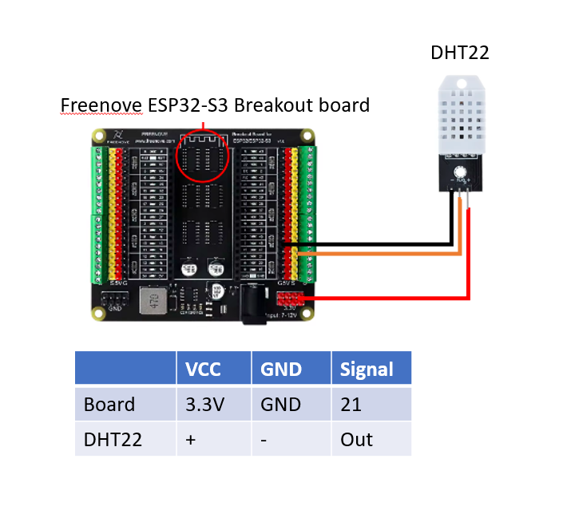
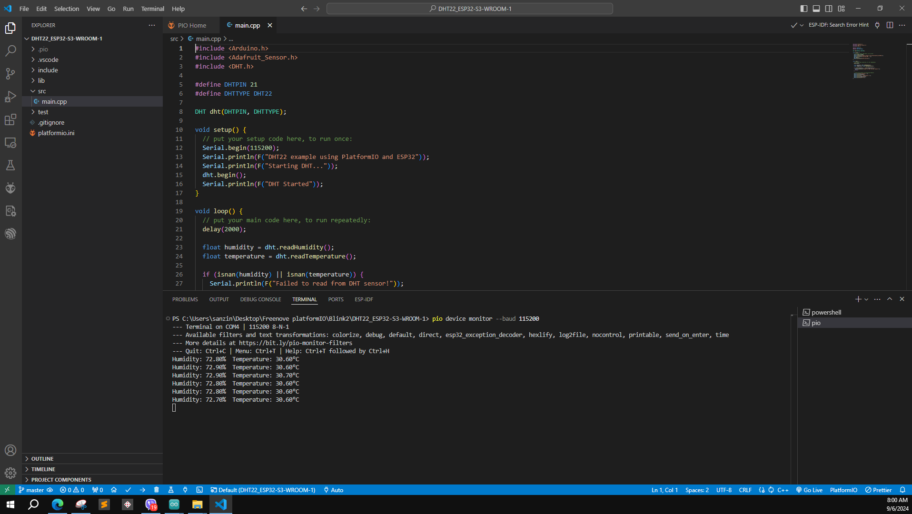

# ESP32-S3-WROOM-1_DHT22_PlatformIO
DHT22 Sensor Data Reading with ESP32-S3

In this test project, the PlatformIO platform is used to read data from a DHT22 sensor with an ESP32 controller board. This project provides an opportunity to learn the basic concepts of using PlatformIO.

The controller board used in this test project is the ESP32-S3 WROOM FREENOVE.

https://github.com/Freenove/Freenove_ESP32_S3_WROOM_Board

Setting Up the ESP32-S3 WROOM FREENOVE Board in PlatformIO

If PlatformIO does not recognize the ESP32-S3 WROOM FREENOVE board, follow these steps:

1) Download the Freenove ESP32 board configuration JSON file from the following link:

https://github.com/sivar2311/freenove-esp32-s3-platformio/blob/main/freenove_esp32_s3_wroom.json
[text](freenove_esp32_s3_wroom.json)

2) Copy the downloaded board JSON file to this location:

C:\Users\(username)\.platformio\platforms\espressif32\boards

3) Use the following command in PlatformIO to verify that the board has been added:

pio check

Wiring connection with ESP32 and DHT22

Serial Output Result

